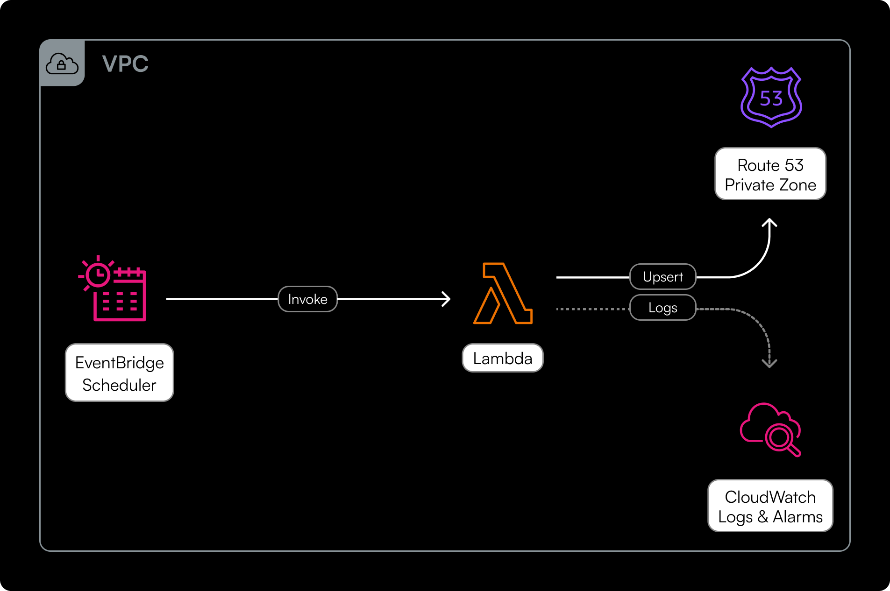
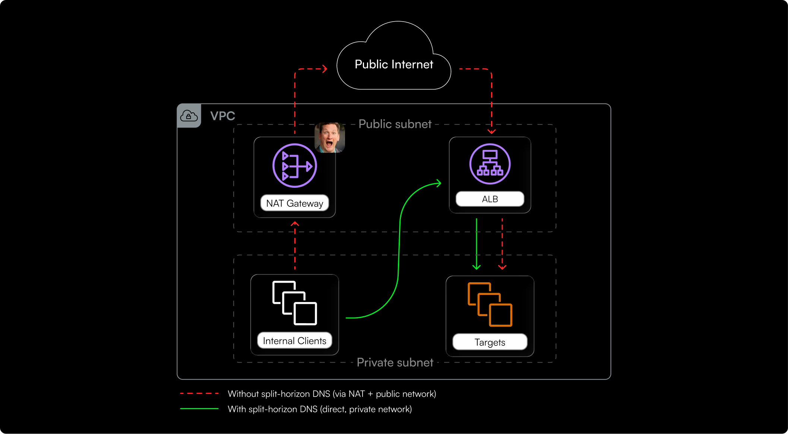

# aws-split-horizon-alb

Split-horizon DNS for an internet-facing Application Load Balancer, as a standalone
CloudFormation stack. A scheduled Lambda keeps a private Route 53 A record pointing at
the ALB's **private** ENI addresses, so callers inside the VPC reach the load balancer
without leaving the private network.

No dependency on other stacks: it works against any existing VPC and ALB.

## Architecture



## Why

An internet-facing ALB publishes only its public addresses in DNS. A service in a private
subnet that resolves `my-alb-123456.eu-west-1.elb.amazonaws.com` therefore gets public IPs,
and its traffic leaves the VPC through a NAT gateway, and back in through the load
balancer's public interfaces. You pay NAT data processing plus data transfer on every
request, for two workloads that sit metres apart in the same VPC.

The ALB's nodes already have private addresses on their ENIs. This stack resolves a private
name to those addresses, so in-VPC traffic reaches the ALB directly over the VPC network.
Callers keep using a hostname, TLS keeps matching, and nothing about the ALB changes.



## How it works

1. Every minute, EventBridge Scheduler invokes the Lambda.
2. The Lambda resolves the ALB's public DNS name to its public IPs.
3. It calls `ec2:DescribeNetworkInterfaces` filtered by `association.public-ip` to find the
   ENIs behind those addresses, and reads their private IPs.
4. If the private A record in the hosted zone differs, it UPSERTs the record.

The Lambda caches the last known public IPs in its execution environment to skip redundant
API calls when the ALB's addresses have not changed.

## Requirements

- **The public DNS name of an internet-facing ALB**, in the same account and region as the
  stack. An internal ALB already resolves to its private addresses, so there is nothing for
  this stack to solve there.
- **An existing VPC** with `enableDnsSupport` and `enableDnsHostnames` enabled: without
  them the private hosted zone is not consulted by instances in the VPC.
- **`CAPABILITY_NAMED_IAM` at deploy time.** The stack creates IAM roles with explicit
  names, which CloudFormation refuses to do under plain `CAPABILITY_IAM`.
- **Deploy permissions** for the principal running the deployment.
  `AdministratorAccess` covers it; a scoped deploy role needs the actions listed below.

  `cloudformation:*` on the stack, plus:

  - **IAM:** `iam:CreateRole`, `iam:DeleteRole`, `iam:GetRole`, `iam:GetRolePolicy`,
    `iam:ListRolePolicies`, `iam:ListAttachedRolePolicies`, `iam:PutRolePolicy`,
    `iam:DeleteRolePolicy`, `iam:PassRole`, `iam:TagRole`, `iam:UntagRole`
  - **Route 53:** `route53:CreateHostedZone`, `route53:DeleteHostedZone`,
    `route53:GetHostedZone`, `route53:GetChange`, `route53:ListQueryLoggingConfigs`,
    `route53:ChangeResourceRecordSets`, `route53:ListResourceRecordSets`,
    `route53:ChangeTagsForResource`, `route53:ListTagsForResource`
  - **EC2:** `ec2:DescribeVpcs` (required by `CreateHostedZone` for private zones)
  - **Lambda:** `lambda:CreateFunction`, `lambda:DeleteFunction`,
    `lambda:GetFunction`, `lambda:InvokeFunction`, `lambda:UpdateFunctionCode`,
    `lambda:UpdateFunctionConfiguration`, `lambda:TagResource`, `lambda:UntagResource`
  - **CloudWatch Logs:** `logs:CreateLogGroup`, `logs:DeleteLogGroup`,
    `logs:DescribeLogGroups`, `logs:PutRetentionPolicy`, `logs:TagResource`,
    `logs:UntagResource`, `logs:ListTagsForResource`
  - **EventBridge Scheduler:** `scheduler:CreateSchedule`, `scheduler:UpdateSchedule`,
    `scheduler:DeleteSchedule`, `scheduler:GetSchedule`
  - **CloudWatch Alarms:** `cloudwatch:PutMetricAlarm`, `cloudwatch:DeleteAlarms`,
    `cloudwatch:DescribeAlarms`, `cloudwatch:ListTagsForResource`,
    `cloudwatch:TagResource`
- **Stack name of 36 characters or fewer.** [See Limitations](#limitations-and-things-to-know).

## Deploying

[](https://console.aws.amazon.com/cloudformation/home#/stacks/quickcreate?templateURL=https%3A%2F%2Faws-split-horizon-alb-template.s3.eu-central-1.amazonaws.com%2Fsplit-horizon-lambda.yml&stackName=split-horizon-alb)

Or via CLI:

```sh
aws cloudformation deploy \
  --template-file split-horizon-lambda.yml \
  --stack-name <stack-name> \                        # max 36 chars
  --capabilities CAPABILITY_NAMED_IAM \
  --parameter-overrides \
      pAlbPublicDnsName=<alb-dns-name> \             # e.g. my-alb-123456.eu-west-1.elb.amazonaws.com
      pCustomAlbPrivateDnsName=<private-dns-name> \  # the private name to create, e.g. lb.internal.example.com
      pVpcId=<vpc-id>                                # VPC to associate the private zone with
```

### Parameters

| Parameter | Required | Description |
| --- | --- | --- |
| `pAlbPublicDnsName` | yes | The ALB's public DNS name, e.g. `my-alb-123456.eu-west-1.elb.amazonaws.com`. |
| `pCustomAlbPrivateDnsName` | yes | Private name to create, e.g. `lb.internal.example.com`. Used as both the hosted zone name and the record name. |
| `pVpcId` | yes | VPC to associate the private hosted zone with. |
| `pAlarmSnsTopicArn` | no | SNS topic for alarm notifications. Empty (default) creates no alarms. |
| `pLogRetentionInDays` | no | Retention for the split-horizon Lambda's log group. Defaults to `7`. Restricted to the values CloudWatch Logs accepts. |
| `pLambdaTimeoutSeconds` | no | Timeout in seconds for the split-horizon Lambda. Defaults to `60`. Lower it when using an external invoker with a shorter interval. |
| `pEnableSchedule` | no | Whether to enable the built-in EventBridge schedule. Defaults to `true`. Set to `false` when using an external invoker (see below). |
| `pEnvironmentTag` | no | Value for the `Environment` tag. Defaults to `production`. |

### Split-horizon DNS setup

Typical setup, with `pCustomAlbPrivateDnsName=lb.my-company.com`:

```text
public zone   app1.my-company.com  CNAME → lb.my-company.com
              app2.my-company.com  CNAME → lb.my-company.com
              lb.my-company.com    ALIAS → my-alb-123456.eu-west-1.elb.amazonaws.com

private zone  lb.my-company.com    A     → ALB private IPs   (this stack)
```

Service names resolve publicly as usual; only `lb.my-company.com` splits. Adding services
costs one public CNAME each, without touching the private zone.

> [!NOTE]
> If the public zone isn't on Route 53, a CNAME in place of the ALIAS works the same way.

## Using an external invoker

By default the stack creates an EventBridge Scheduler that invokes the Lambda every minute.
If you prefer to use your own scheduler (cron, Step Functions, etc.), deploy the
stack with `pEnableSchedule=false`. The built-in schedule is created but disabled, so all
CloudFormation dependencies remain intact and stack deletion works normally.

### Getting the function ARN

Read the ARN from the stack outputs, where it is also exported as `${StackName}-SplitHorizonLambdaArn`:

```sh
aws cloudformation describe-stacks \
  --stack-name <stack-name> \
  --query "Stacks[0].Outputs[?OutputKey=='SplitHorizonLambdaArn'].OutputValue" \
  --output text
```

### Invoking the Lambda

```sh
aws lambda invoke \
  --function-name <lambda-arn> \
  /dev/null
```

### IAM policy for the external invoker

Attach this policy to the identity (role, user, or service) that will invoke the Lambda,
using the same ARN as the resource:

```json
{
  "Version": "2012-10-17",
  "Statement": [
    {
      "Effect": "Allow",
      "Action": "lambda:InvokeFunction",
      "Resource": "<lambda-arn>"
    }
  ]
}
```

### Choosing the right timeout

Set `pLambdaTimeoutSeconds` lower than the invocation interval to avoid overlapping
executions. For example, if invoking every 30 seconds, a timeout of 25 seconds ensures a
timed-out run finishes before the next one starts. The Lambda typically completes in under
5 seconds, so the timeout is a safety net rather than an expected duration.

## Resources

Thirteen resources, eleven of them unconditional.

| Logical ID | Type | Purpose |
| --- | --- | --- |
| `PrivateHostedZone` | `AWS::Route53::HostedZone` | Private zone for `pCustomAlbPrivateDnsName`, associated with `pVpcId`. |
| `PrivateRecordA` | `AWS::Route53::RecordSet` | The A record the Lambda maintains. Created with placeholder addresses. |
| `SplitHorizonLambdaRole` | `AWS::IAM::Role` | Execution role: ENI reads, and Route 53 writes scoped to this zone only. |
| `SplitHorizonLambda` | `AWS::Lambda::Function` | Reconciles the record with the ALB's current private IPs. |
| `SplitHorizonLambdaLogGroup` | `AWS::Logs::LogGroup` | Logs for the above. Retention set by `pLogRetentionInDays`. |
| `SchedulerInvokeRole` | `AWS::IAM::Role` | Lets EventBridge Scheduler invoke the Lambda. |
| `SplitHorizonSchedule` | `AWS::Scheduler::Schedule` | EventBridge Schedule with `rate(1 minute)`, no retries. |
| `RestoreSeedRecordFunctionRole` | `AWS::IAM::Role` | Lets the lambda restore seed record. |
| `RestoreSeedRecordFunction` | `AWS::Lambda::Function` | Restores the placeholder record on custom DNS name change or stack deletion. |
| `RestoreSeedRecordLambdaLogGroup` | `AWS::Logs::LogGroup` | Logs for the above, 7-day retention. |
| `RestoreSeedRecordInvoke` | `AWS::CloudFormation::CustomResource` | Triggers the restore function. Restores placeholder IPs on update (when custom DNS name changes) and on delete. |
| `SplitHorizonLambdaErrorAlarm` | `AWS::CloudWatch::Alarm` | 5+ Lambda errors in 5 minutes. Only if `pAlarmSnsTopicArn` is set. |
| `SplitHorizonLambdaNoInvocationAlarm` | `AWS::CloudWatch::Alarm` | Fewer than 1 invocation in 5 minutes — catches a stopped schedule. Only if `pAlarmSnsTopicArn` is set. |

## Dependency order

Resources are ordered so that nothing invokes the Lambda until the record and the teardown
helper are both in place, and deletion runs in reverse: the function is gone before the
restore runs.
See the [blog post](https://polarity.dev/en/blog/aws-split-horizon-alb) for the full dependency
tree and teardown explanation.

### Deletion and DNS name changes

The stack includes a custom resource (`RestoreSeedRecordInvoke`) that restores the
placeholder A record values before CloudFormation attempts to delete the record and
the hosted zone. This handles two scenarios:

- **Stack deletion:** the restore runs so CloudFormation's `DELETE` matches the record's
  current values.
- **`pCustomAlbPrivateDnsName` change:** the hosted zone and record are replaced.
  The custom resource receives an Update event and restores the seed IPs on the
  **old** zone before CloudFormation deletes it.

> [!NOTE]
> If stack deletion fails with `InvalidChangeBatch`, manually set the A record back to
> the placeholder addresses (`10.1.2.3`, `10.4.5.6`) and retry the deletion.

## Limitations and things to know

**Stack names are capped at 36 characters.** IAM role names are limited to 64 characters.
The longest role name in this stack is `${StackName}-sh-scheduler-${Region}`: the suffix
is 14 characters, and the longest region names (`ap-southeast-4`, `ap-northeast-3`) are
another 14, leaving 36 for the stack name. A longer name fails at role creation. The region
is in the name on purpose: IAM is global, so without it the same stack could not be deployed
twice in one account.

**Convergence takes up to about two minutes.** One minute of schedule interval, plus the
record's 60-second TTL, plus resolver caching. However, when the ALB scales in or replaces
a node, AWS [removes that node from DNS first and keeps it serving traffic during a grace
period](https://www.repost.aws/questions/QUsFZA7q1lT3ab7Qg055Vl4w) while connections drain.
This means that even if the private record update lags behind, traffic directed to the
old address is still served.

**The record is CloudFormation-owned but Lambda-written.** Drift detection will always report
`PrivateRecordA` as modified. That is expected. If the record is manually deleted or
replaced with an alias, the Lambda will recreate the correct A record on the next cold start
or the next time the ALB's public IPs change.

**The placeholder addresses appear twice** — in `PrivateRecordA` and in the restore
function's `SEED_IPS`. They must stay identical, or the restore writes values CloudFormation
does not expect and the delete fails for the original reason.

**Alarm coverage.** With `pAlarmSnsTopicArn` unset there is no alarm at all, and a stale
record fails silently. Setting it is recommended. Note that the no-invocation alarm uses
`TreatMissingData: breaching`, since a stopped schedule shows up as absent data rather than
as zeros.

## Cost

~$0.50/month (one private hosted zone). All other resources fall within AWS perpetual
free tier allowances. On an account already consuming those allowances, up to ~$0.70/month.

For comparison, an internal ALB starts at ~$16/month before LCU charges.

See the cost breakdown in the [blog post](https://polarity.dev/en/blog/aws-split-horizon-alb) for full details.

## Author

Built by [Polarity](https://polarity.dev). See [AUTHORS](AUTHORS.md) for the full list.

Questions, issues, and PRs are welcome — open an issue or start a discussion.

## License

Apache 2.0. See [LICENSE](LICENSE).
